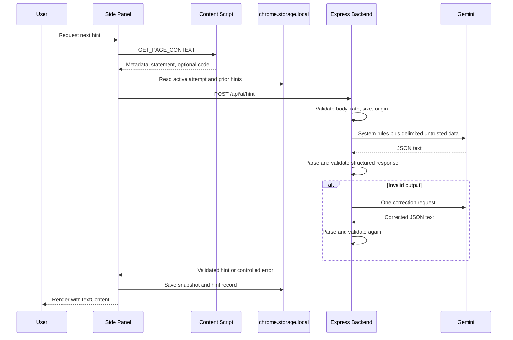

# CodeAssist V5 Architecture

## Extension components

`manifest.json` declares a Manifest V3 service worker, popup, Side Panel, and content scripts for supported problem routes. Permissions are limited to `activeTab`, `sidePanel`, and `storage`; host access covers supported coding sites and the local backend.

- `background/serviceWorker.js` initializes and migrates local storage on install, startup, and worker activation. It performs no model requests.
- `platforms/` owns page detection and extraction. `index.js` selects an adapter by URL and returns one normalized page context.
- `content/contentScript.js` exposes that context through `GET_PAGE_CONTEXT` and notifies extension pages after relevant page changes.
- `popup/` shows basic current-page state, backend health, quick bookmark, and Side Panel launch.
- `sidepanel/` owns the V5 user workflow and safe DOM rendering.
- `services/storageService.js` owns schema migration, preferences, and bookmark persistence.
- `services/attemptService.js` owns attempt state transitions, snapshots, hints, diagnoses, and feedback.
- `services/apiClient.js` owns backend timeouts, cancellation, JSON parsing, and user-safe network errors.
- `services/exportService.js` builds three local Excel sheets and neutralizes formula-like cell prefixes.
- `utils/` contains safe DOM, URL, time, and insight helpers.

## Backend components

- `config/env.js` validates all environment configuration before the server starts.
- `app.js` composes security headers, CORS, request-size limiting, health, rate limiting, API routes, and error handling.
- `schemas/` validates extension requests and model responses with Zod.
- `prompts/` separates system instructions, untrusted user data, safety rules, and response schemas.
- `services/geminiService.js` owns the model HTTP call, timeout, provider-status mapping, JSON parsing, one correction retry, and final schema validation.
- `controllers/aiController.js` maps validated endpoint input to the correct prompt and response schema.
- `middleware/` provides CORS, IP rate limiting, body validation, and safe errors.

## Message flow



## Storage schema

The top-level local record is stored under `codeAssistV5`:

```javascript
{
  schemaVersion: 5,
  bookmarks: [],
  attempts: [],
  activeAttempt: "attempt_id" | null,
  preferences: {
    responseLanguage: "hinglish" | "english",
    backendUrl: "http://localhost:8787"
  },
  migrations: {
    legacyBookmarksV5Completed: true,
    migratedAt: "ISO timestamp"
  }
}
```

An attempt stores identity, canonical problem URL, statement, timestamps, elapsed time, explicit code snapshots, hint records, highest hint level, notes, failed-case fields, final status, diagnosis, and diagnosis feedback. `activeAttempt` references an attempt ID rather than holding volatile worker memory. The visible timer is recalculated from `startTimestamp`, which makes worker restart recovery deterministic.

## Structured-output flow

1. Zod validates and bounds every request field.
2. A prompt module creates system rules and a separately delimited JSON data block.
3. Gemini is asked for JSON response MIME type.
4. The backend extracts text and parses one JSON object.
5. Endpoint-specific Zod schemas enforce enums, score ranges, confidence range, and `revealsFinalSolution: false`.
6. Invalid or empty output gets one correction attempt.
7. A second failure becomes `INVALID_MODEL_RESPONSE`; malformed model text is never returned.

## Error flow

Provider details and stack traces are logged only in development server output. The extension receives stable codes such as `INVALID_REQUEST`, `RATE_LIMITED`, `MODEL_TIMEOUT`, `MODEL_RATE_LIMITED`, `MODEL_UNAVAILABLE`, and `INVALID_MODEL_RESPONSE`. Backend failure does not block bookmarks, attempt history, migration, or export because those remain local.

Closing the Side Panel aborts in-flight browser fetches. A result is stored only after a complete validated response arrives. If the service worker restarts, storage initialization is idempotent and the active attempt remains recoverable.

## Security decisions

The Gemini API cannot be safely protected in client-side extension code because users and installed browser tooling can inspect the bundle and network calls. CodeAssist therefore routes all model traffic through the backend, where secrets, timeouts, model selection, validation, and rate policy can be controlled.

Extension-origin CORS is permissive only for `chrome-extension://` origins during local setup. Once `EXTENSION_ORIGIN` is configured, it becomes an exact-origin check. Production deployment should use HTTPS, set the exact extension origin, and add only the deployed API host to extension host permissions.
