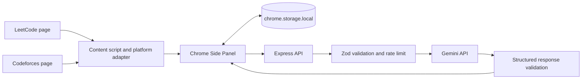

# CodeAssist V5

CodeAssist V5 is a Manifest V3 Chrome extension and local Node.js service that acts as a DSA cognitive coach. It does not generate complete coding solutions. It helps a learner work through progressive Socratic hints, capture deliberate code snapshots, diagnose an attempt from available evidence, and review local learning history.

## Engineering highlights

- Secure extension-to-backend architecture keeps Gemini credentials out of browser code.
- Zod validates both inbound requests and structured model responses.
- Prompt-injection boundaries treat problem statements, code, notes, and tests as untrusted data.
- Attempt state and timers survive Manifest V3 service-worker restarts.
- Platform adapters isolate LeetCode and Codeforces DOM behavior.
- All user and AI content is rendered with safe DOM APIs rather than raw HTML.
- Automated tests cover API failures, migration, persistence, rate limiting, prompt injection, and XSS-like input.

## Quick demo flow

1. Open a LeetCode problem and launch the CodeAssist Side Panel.
2. Start an attempt and capture the current editor code or paste it manually.
3. Request progressive Hint Levels 1-4 and observe sequential unlocking.
4. Add a failed input, expected output, actual output, and learner notes.
5. Analyze the attempt, rate the diagnosis, and end the session.
6. Review the saved report and local learning insights in History.
7. Export bookmarks, attempts, and diagnosis summaries to Excel.

## Current V5 features

- Lightweight popup with current problem, quick bookmark, backend status, and Side Panel launcher.
- Persistent Side Panel with Coach, Attempt, History, and Bookmarks sections.
- Full LeetCode coaching context with resilient title, statement, difficulty, language, and editor-code selector fallbacks.
- Codeforces bookmark compatibility with an honest "coming soon" state for AI coaching.
- Four intentional hint levels, from a clarifying question to language-neutral pseudocode.
- Attempt timer, manual notes, failed test evidence, explicit code snapshots, end status, and restart recovery.
- Structured attempt diagnosis with evidence, strengths, scores, confidence, hint dependency, next action, and user accuracy feedback.
- Local history filters and locally calculated insights after at least three completed attempts.
- Versioned V5 storage with idempotent migration from `leetCodeBookmarks`.
- Safe DOM rendering and HTTPS-only problem links.
- Excel export with Bookmarks, Attempts, and Diagnosis Summary sheets.

## Architecture



The model credential never enters the extension. The Side Panel sends validated attempt context to the local backend; the backend builds injection-aware prompts, calls the configured Gemini model, validates JSON output, retries malformed output once, and returns only the safe structured result.

See [ARCHITECTURE.md](ARCHITECTURE.md) for the component and message-flow details.
See [DEPLOYMENT.md](DEPLOYMENT.md) for Render and Chrome Web Store deployment.

## Security design

- `GEMINI_API_KEY` is read only from `server/.env` and sent to Gemini in a server-side request header.
- The previously exposed V4 credential is not retained anywhere in this project. Revoke that old credential in Google AI Studio or Google Cloud and create a new restricted key.
- `.env` and `node_modules` are ignored by Git.
- Express limits JSON request size, applies IP-based rate limiting, times out model requests, and returns controlled errors.
- `EXTENSION_ORIGIN` restricts CORS to one installed extension ID when configured.
- Problem statements, code, comments, notes, and test cases are marked as untrusted prompt data.
- Model output is parsed and validated with Zod. Invalid output receives one correction retry and is never forwarded raw.
- Extension code renders AI and user-controlled values with `textContent` and DOM APIs, never dynamic raw HTML.
- Problem links must use `https:` and a supported host before an anchor is created.

## Backend setup

Node.js 20 or newer is required.

```powershell
cd C:\Users\kaush\OneDrive\Desktop\CodeAssist\server
npm install
Copy-Item .env.example .env
```

Edit `server/.env` and set a newly created key and the model available to your Gemini account:

```dotenv
GEMINI_API_KEY=your_new_server_side_key
GEMINI_MODEL=gemini-3.5-flash-lite
PORT=8787
EXTENSION_ORIGIN=
```

Start the service:

```powershell
npm run dev
```

For normal non-watch mode:

```powershell
npm start
```

Verify it:

```powershell
Invoke-RestMethod http://localhost:8787/health
```

Expected status is `ok`. AI endpoints require a valid key and model; `/health` does not make a paid model request.

### Local CORS configuration

For the first local launch, an empty `EXTENSION_ORIGIN` allows Chrome extension origins only. After loading the unpacked extension, copy its ID from `chrome://extensions`, set:

```dotenv
EXTENSION_ORIGIN=chrome-extension://your_extension_id
```

Restart the backend. This pins browser access to that extension installation. Requests without an Origin remain allowed for local health checks and automated tests.

## Load the extension

1. Open `chrome://extensions`.
2. Enable **Developer mode**.
3. Click **Load unpacked**.
4. Select `C:\Users\kaush\OneDrive\Desktop\CodeAssist\extension`.
5. Open a LeetCode problem and refresh that tab once so the V5 content script is active.
6. Click the CodeAssist toolbar icon, confirm backend status, and click **Open CodeAssist Coach**.

The default backend is `http://localhost:8787`. To use another local port, open the Coach section, update **Backend URL**, and save it. This build grants network access only to `localhost` and `127.0.0.1`; a remote deployment must also add its exact HTTPS origin to `manifest.json`.

## Use the coach

Open a LeetCode problem and click **Start Attempt**. The start timestamp and active attempt ID are saved immediately, so the timer recovers after a Side Panel or service-worker restart.

Use **Capture Code** when you want a deliberate snapshot. Code is also snapshotted, when present, on a hint request, diagnosis request, or attempt end. CodeAssist does not log keystrokes. If LeetCode's editor DOM is inaccessible, paste code into the Attempt section.

Hint levels unlock one at a time:

1. Clarifying Question
2. Constraint or Key Observation
3. Pattern Direction
4. Algorithm Skeleton or Pseudocode

Levels 1-3 cannot reveal the final solution. Level 4 can provide language-neutral pseudocode but not executable final code. Every hint is saved in the current attempt and included when requesting the next level.

**Analyze My Attempt** sends the available problem, code, elapsed time, hints, notes, snapshots, and failed-case fields to the backend. The validated diagnosis is saved locally. Mark it Accurate, Partially accurate, or Inaccurate to retain evaluation feedback. AI feedback is advisory, not absolute truth.

An ended attempt without a diagnosis can also be analyzed from History using its saved final snapshot and evidence. History reports allow the same diagnosis-accuracy feedback.

## Local data

All product data remains in `chrome.storage.local` under `codeAssistV5`:

- Bookmarks and migrated notes
- Attempts and active attempt reference
- Code snapshots and hint history
- Diagnoses and diagnosis feedback
- Response language and local backend URL

There are no user accounts, cloud sync, analytics, or remote learning-history database in V5. AI request context is sent to the configured Gemini service only when the user requests a hint or diagnosis.

See [MIGRATION.md](MIGRATION.md) for legacy bookmark handling.

## Testing

Tests use mocked model responses and do not require a Gemini key:

```powershell
cd C:\Users\kaush\OneDrive\Desktop\CodeAssist\server
npm test
```

Coverage includes health, request validation, mocked structured hints, malformed JSON correction, timeout, diagnosis validation, rate limiting, prompt injection boundaries, secret-safe errors, bookmark migration, duplicate prevention, URL safety, XSS-like text rendering, timer recovery, active-attempt recovery, hint storage, and low-data insights.

## Troubleshooting

- **Backend offline:** Run `npm start`, verify `http://localhost:8787/health`, and check the Side Panel backend URL.
- **Origin not allowed:** Set `EXTENSION_ORIGIN=chrome-extension://<installed-id>` and restart the backend. Reloading unpacked from a stable folder normally keeps the ID stable.
- **AI service not configured:** Confirm `GEMINI_API_KEY` and `GEMINI_MODEL` in `server/.env`. Do not put either value in extension files.
- **Quota or rate limit:** Wait and retry. The UI receives a controlled error while bookmarks and history continue working locally.
- **Problem statement unavailable:** Refresh the LeetCode tab, then reopen the panel. LeetCode DOM changes can temporarily break extraction.
- **Code unavailable:** Paste code manually. Monaco's editor value is not always exposed reliably to an isolated content script.
- **Popup cannot open Side Panel:** Update Chrome to version 116 or newer and reload the extension.
- **Old bookmarks missing:** Verify the old Chrome profile still contains `leetCodeBookmarks`; migration runs in the same extension storage identity. See the migration note below about unpacked extension IDs.

## Current limitations

- LeetCode DOM extraction relies on public page structure and safe selector fallbacks, so site changes may require adapter maintenance.
- Automatic Monaco editor extraction is best effort. Manual paste is the reliable fallback.
- Codeforces V5 supports bookmarks only; full AI coaching is intentionally not claimed.
- The backend does not execute code, verify runtime behavior, or intercept submissions.
- Gemini can still make reasoning mistakes even after schema validation. Validation guarantees shape and safety fields, not factual correctness.
- Unpacked extension storage migration requires V5 to use the same Chrome extension ID/profile as V4. If Chrome assigns a different ID because the load path changed, follow [MIGRATION.md](MIGRATION.md).
- V5 is local-first with no account, cloud backup, sync, RAG, or scientific interview-readiness score.

## Future roadmap

The recommended V6 direction is RAG-based personal learning memory, concept-transfer test generation, verified code execution, an AI mock interviewer, and opt-in cloud sync with mentor reports.
